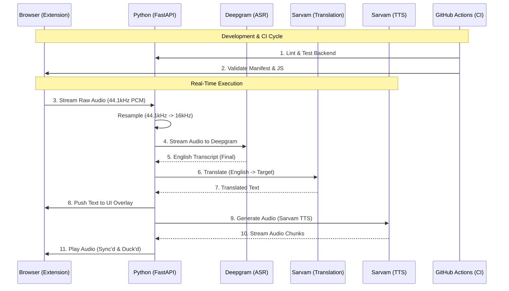

# LinguaStream Project Context & Roadmap

## 1. Project Overview
**LinguaStream** is a cross-platform application designed to provide real-time, live translation of streaming audio (e.g., YouTube, Coursera) into Indian languages (Telugu, Hindi, Tamil, Kannada).

**Key Differentiator:** It handles "Code-Mixing" (Hinglish/Tanglish) natively using specialized AI models (**Sarvam AI**), ensuring technical terms remain in English while grammar and casual speech are translated.

## 2. Architecture: "The Real-Time Dubbing Pipeline"

**Core Goal:** Real-time translation of **English Audio (Source)** into **Indian Language Audio (Target)**.

The system follows a **3-Stage Sequential Pipeline** orchestrated by the Python Backend.

### **The Pipeline (Strict 3-Step Architecture)**



1.  **Stage 0: Quality Gate (GitHub Actions)**
    *   **CI Workflows:** Automated linting with `ruff` and testing with `pytest` for the backend. Syntax validation and Manifest V3 compliance checks for the extension.
    *   **Goal:** Ensure code stability before any changes are merged or deployed.

2.  **Stage 1: ASR (English Transcription)**
    *   **Provider:** **Deepgram (Nova-2)**
    *   **Input:** Raw Audio Stream (English) from Browser.
    *   **Output:** Real-time English Transcript.
    *   **Why:** Industry-leading speed and accuracy for streaming English.

2.  **Stage 2: Translation (Text-to-Text)**
    *   **Provider:** **Sarvam AI (Translate API)**
    *   **Input:** English Text (from Stage 1).
    *   **Output:** Indian Language Text (Hindi, Telugu, Tamil, Kannada).
    *   **Why:** Optimized for Indian linguistic nuances and "Code-Mixing" (Hinglish).

3.  **Stage 3: TTS (Speech Synthesis)**
    *   **Provider:** **Sarvam AI (bulbul:v3)**
    *   **Input:** Translated Text (from Stage 2).
    *   **Output:** High-quality Indian Language Audio (16kHz PCM).
    *   **Why:** Best-in-class voice quality for Indian language accents, perfectly complementing their translation model.

### **Frontend: Chrome/Brave Extension**
*   **Role:** Captures tab audio, sends to Backend, plays back the dubbed audio.
*   **Audio Ducking:** When dubbed audio is received, the original YouTube video volume is lowered (ducked) to ~20%.

### **Backend: Python Orchestrator (FastAPI)**
*   **Role:** Manages the WebSocket connection and chains the 3 API calls.
*   **Latency Management:** Critical. Must handle asynchronous events between the 3 stages efficiently.

---

## 3. Current Status (Week 6 Progress - Dubbing & Optimization)
* ✅ **Repository Setup:** Monorepo structure established.
* ✅ **Audio Capture:** Extension successfully captures tab audio via `offscreen` API.
* ✅ **3-Stage Pipeline:** Successfully orchestrated Deepgram (ASR) -> Sarvam Translate -> Sarvam TTS.
* ✅ **Streaming Audio:** Real-time TTS streaming implemented with gapless playback in the browser.
* ✅ **Translation Quality:** Enabled `code-mixed` translation to natively handle technical English terms in Indian languages.
* ✅ **Latency Tuning:** Decoupled ASR from TTS via async queues, adopted Deepgram's `speech_final`, and implemented audio catch-up buffering.

---

## 4. Comprehensive Directory Structure (Target State)
*Use this structure to maintain context of where new files belong.*

```text
linguastream/
├── .github/                       # CI/CD & Templates
│   ├── workflows/                 
│   │   ├── auto-test.yml          # (Planned) Unit tests on PR
│   │   └── deploy-backend.yml     # (Planned) Docker build/push
│   └── PULL_REQUEST_TEMPLATE.md   
├── assets/                        # Design assets
│   ├── diagrams/                  # Architecture flowcharts
│   └── branding/                  # Logos (icon16.png, icon48.png, etc.)
├── backend/                       # 🧠 THE BRAIN: Python Audio Orchestrator
│   ├── app/
│   │   ├── __init__.py
│   │   ├── main.py                # ✅ Entry point & WebSocket router (VAD logic here)
│   │   ├── core/                  # Configurations
│   │   │   ├── __init__.py
│   │   │   └── config.py          # (Planned) Env var loader (API Keys)
│   │   ├── audio/                 # Audio Processing Logic
│   │   │   ├── __init__.py
│   │   │   ├── processor.py       # (Planned) Resampling & filtering logic
│   │   │   └── buffer.py          # (Planned) Jitter buffer & sync logic
│   │   └── services/              # External AI Integrations
│   │       ├── __init__.py
│   │       ├── deepgram_client.py         # ✅ Deepgram ASR WebSockets
│   │       ├── sarvam_translate_client.py # ✅ Sarvam Translation API
│   │       └── sarvam_tts_client.py       # ✅ Sarvam Text-to-Speech API
│   ├── tests/                     # Backend Tests
│   │   ├── __init__.py
│   │   ├── test_main.py           # ✅ Connection tests
│   │   └── test_audio.py          # (Planned) Resampling quality tests
│   ├── Dockerfile                 # (Planned) Container definition
│   ├── docker-compose.yml         # (Planned) Orchestration
│   ├── requirements.txt           # ✅ Python dependencies
│   └── .env                       # (Ignored) Secrets
├── clients/                       # 👂 THE EARS: Frontend Clients
│   ├── extension/                 # Chrome/Brave Extension
│   │   ├── manifest.json          # ✅ Manifest V3 Config
│   │   ├── src/
│   │   │   ├── background.js      # ✅ Extension Coordinator
│   │   │   ├── offscreen.html     # ✅ Audio Host Page
│   │   │   ├── offscreen.js       # ✅ Audio Capture Logic
│   │   │   ├── content.js         # (Planned) UI Overlay Injection
│   │   │   ├── popup.html         # ✅ Extension Menu UI
│   │   │   └── popup.js           # ✅ Extension Menu Logic
│   │   └── assets/                # Packed icons
│   └── mobile/                    # (Planned) Future Android/iOS Client
│       ├── pubspec.yaml           # (Placeholder) Flutter config
│       ├── android/
│       └── lib/
│           └── webview_bridge.dart # (Planned) Audio injection bridge
├── docs/                          # Project Documentation
│   ├── API_REFERENCE.md           # Internal WebSocket protocol
│   └── SETUP_GUIDE.md             # Dev environment setup
├── scripts/                       # Dev Tools
│   ├── start_dev.sh               # (Planned) One-click start script
│   └── latency_test.py            # (Planned) Lag measurement tool
├── GEMINI.md                      # ✅ This Project Context File
├── .gitignore                     # ✅ Git ignore rules
└── README.md                      # ✅ Project Landing Page
```

---

## 5. Detailed 8-Week Development Roadmap

### **Phase 1: Foundation & "The Pipeline" (Weeks 1-2)**

*Focus: Establishing the connection between the Browser and Python.*

* **Week 1: MVP Audio Capture & VAD (Completed)**
* [x] Setup Monorepo & Git Flow.
* [x] Implement `manifest.json` & `offscreen` audio capture.
* [x] Build FastAPI WebSocket Server.
* [x] Integrate Silero VAD to filter non-speech audio.
* [x] Verification: `.wav` file recording.


* **Week 2: Audio Resampling & Loopback Test (Completed)**
* [x] **Backend:** Refactor `main.py` to move logic into `audio/processor.py` for cleaner architecture.
* [x] **Backend:** Implement robust `scipy.signal.resample_poly` (44.1kHz -> 16kHz) to improve audio quality for the AI.
* [x] **Feature:** Create a "Loopback" endpoint. (Browser Mic -> Python -> Browser Speakers). This is critical to *hear* the latency delay.
* [x] **Frontend:** Update `popup.html` to show real-time connection status (Green/Red indicators) instead of just the browser badge.


### **Phase 2: Core Translation Engine (Weeks 3-4)**

*Focus: Integrating Sarvam AI and handling Indian languages.*

* **Week 3: Sarvam AI Integration (Backend Complete)**
* [x] **Backend:** Create `services/sarvam_client.py`.
* [x] **Protocol:** Implement the specific WebSocket handshake for Sarvam's `speech-to-text-translate` API.
* [x] **Authentication:** Securely load API keys from `.env`.
* [x] **Logic:** Handle Sarvam's "Partial" vs "Final" transcript events to reduce text flickering on the UI.


* **Week 4: The Visual Overlay (Subtitle Sync)**
* [x] **Frontend:** Build `content.js` to inject a floating, draggable `<div>` over the YouTube video player.
* [x] **Backend:** Send translated text *with timestamps* back to the extension.
* [x] **Sync Logic:** Implement a "Jitter Buffer" in `buffer.py`. (Calculate the delay between "Speech Sent" and "Text Received" and delay the display to match).


### **Phase 3: Robustness & Audio Dubbing (Weeks 5-6)**

*Focus: Improving quality and implementing the Real-Time Dubbing Pipeline.*

* **Week 5: Architecture Pivot & Streaming (Completed)**
* [x] **Architecture:** Pivoted to 3-Stage Pipeline (Deepgram -> Sarvam Translate -> Sarvam TTS).
* [x] **Frontend:** Added Language Picker to Extension Popup (Supporting 11 Languages).
* [x] **Backend:** Implemented `DeepgramService`, `SarvamTranslateService`, and `SarvamTTSService`.
* [x] **Streaming:** Implemented async generator streaming for TTS audio.
* [x] **Sync:** Fixed 16kHz playback synchronization and gapless scheduling in `offscreen.js`.
* [x] **Testing:** Reorganized manual testing scripts into `tests/manual/` and `tests/integration/`.


* **Week 6: Audio Dubbing & Optimization (Completed)**
* [x] **Backend:** Optimized latency via async queues, threshold dispatching (1.5s/6 words), and Deepgram's `speech_final` event.
* [x] **Translation:** Switched to "code-mixed" mode to naturally integrate technical English terms.
* [x] **Frontend:** Implemented "Audio Ducking" in `content.js` and Audio catch-up buffering in `offscreen.js`.
* [x] **Fix:** Resolved issue where Overlay/Ducking failed when switching tabs by tracking `recordingTabId` in `background.js`.
* [x] **Fix:** Added teardown logic to stop extension recording when the Python backend disconnects.

### **Phase 4: Optimization, Mobile & Launch (Weeks 7-8)**

*Focus: Performance tuning and packaging.*

* **Week 7: Performance & Mobile Architecture**
* [ ] **Benchmark:** Run `scripts/latency_test.py`. If processing > 200ms, rewrite `resample` in Rust (PyO3).
* [ ] **Mobile:** Initialize `clients/mobile` Flutter project.
* [ ] **Mobile Bridge:** Implement the Android `WebView` bridge to inject JavaScript for audio capture on mobile.


* **Week 8: Documentation & Release**
* [x] **Docs:** Finalize `SETUP_GUIDE.md` and internal API docs (Updated in README/GEMINI).
* [ ] **Ops:** Create `Dockerfile` and `docker-compose.yml` for easy 1-click deployment.
* [ ] **Release:** Submit Extension to Chrome Web Store (Unlisted/Beta).
* [x] **Release:** Tag v1.0 on GitHub (Current state pushed).


## 6. Troubleshooting & Notes

* **SSL Error:** Python on macOS requires running `Install Certificates.command` to fix `torch.hub.load` errors.
* **IPv6 Issue:** Chrome Extensions must connect to `127.0.0.1`, not `localhost`.
* **Brave Browser:** Shields must be DOWN for the YouTube tab to allow audio capture.
* **VAD Buffer Error:** Silero VAD requires exactly 512 samples (at 16kHz). We implemented a buffer in `main.py` to ensure this exact chunk size is always passed to the model.
* **Tab Capture Error:** `getMediaStreamId` must be called in `background.js` without a specific `consumerTabId` to allow the offscreen document to consume the stream.
* **Background Tab Targeting:** Fixed a bug where Overlay & Ducking failed if the user switched tabs. `background.js` now tracks `recordingTabId` to ensure messages are always sent to the video tab, not the currently active tab.
* **Uvicorn Import Error:** `ModuleNotFoundError: No module named 'app'` occurs if Uvicorn is run from the project root instead of the `backend/` directory.
* **Sarvam WebSocket 403 Error:** Sarvam's `wss://api.sarvam.ai/speech-to-text-translate` endpoint is currently restricted (403 Forbidden) and missing from their official Python SDK. Stick to the 3-Stage pipeline.
* **Audio Drift & Buffering:** Translated audio is often phonetically longer than English. Counteract this by setting Sarvam TTS pace to 1.2 and managing playback sync carefully in `offscreen.js`.
