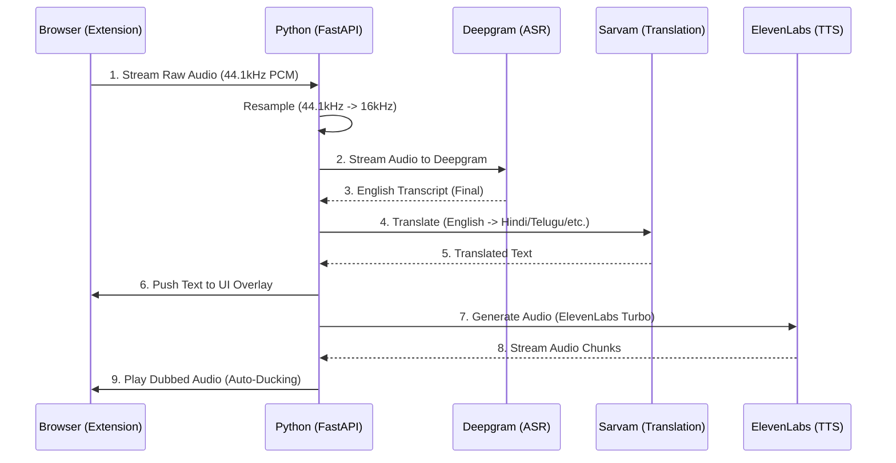

# LinguaStream 🎙️🇮🇳

> **Real-time, cross-platform live translation for streaming content (YouTube/Coursera) into Indian languages.**


## 📖 Overview
LinguaStream is a browser-based translation overlay that enables users to watch English educational content with real-time audio/text translations in **Telugu, Hindi, Tamil, and Kannada**.

It uses a **3-Stage Sequential AI Pipeline** to deliver human-like dubbing with minimal latency.

## 🏗️ Architecture: The 3-Stage Pipeline

LinguaStream orchestrates three specialized AI services to achieve high-quality real-time dubbing:



1.  **Stage 1: ASR (Deepgram)** - Converts English audio to text in real-time.
2.  **Stage 2: Translation (Sarvam AI)** - Translates English to Indian languages, preserving technical context.
3.  **Stage 3: TTS (ElevenLabs)** - Synthesizes high-quality speech for the final dub.

---

## 🚀 Installation & Setup

### 1. Backend Setup (Python)
The backend requires Python 3.10+ and API keys for the services above.

```bash
# Clone the repository
git clone https://github.com/your-username/linguastream.git
cd linguastream/backend

# Create a virtual environment
python -m venv .venv
source .venv/bin/bin/activate  # On Windows: .venv\Scripts\activate

# Install dependencies
pip install -r requirements.txt

# Setup Environment Variables
cp .env.example .env
# Edit .env and add your DEEPGRAM_API_KEY, SARVAM_API_KEY, and ELEVENLABS_API_KEY
```

**Run the Backend:**
```bash
python -m app.main
```
The server will start at `ws://127.0.0.1:8000`.

### 2. Extension Setup (Chrome/Brave)
1.  Open Chrome and navigate to `chrome://extensions/`.
2.  Enable **Developer Mode** (top right).
3.  Click **Load unpacked**.
4.  Select the `clients/extension` folder from this repository.
5.  Click the LinguaStream icon in your toolbar to open the popup.

---

## 🛠️ Technical Highlights (For Interviewers)
- **Web Audio API:** High-performance audio capture and PCM resampling in the browser.
- **WebSocket Orchestration:** Full-duplex communication for simultaneous audio upload and transcript download.
- **Audio Ducking:** Automatically lowers host video volume when translated audio is playing.
- **Gapless Playback:** Implements a jitter buffer and precise scheduling for smooth TTS audio streaming.

---

## 📄 License
This project is licensed under the MIT License - see the [LICENSE](LICENSE) file for details.
